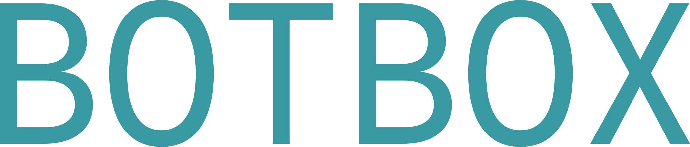
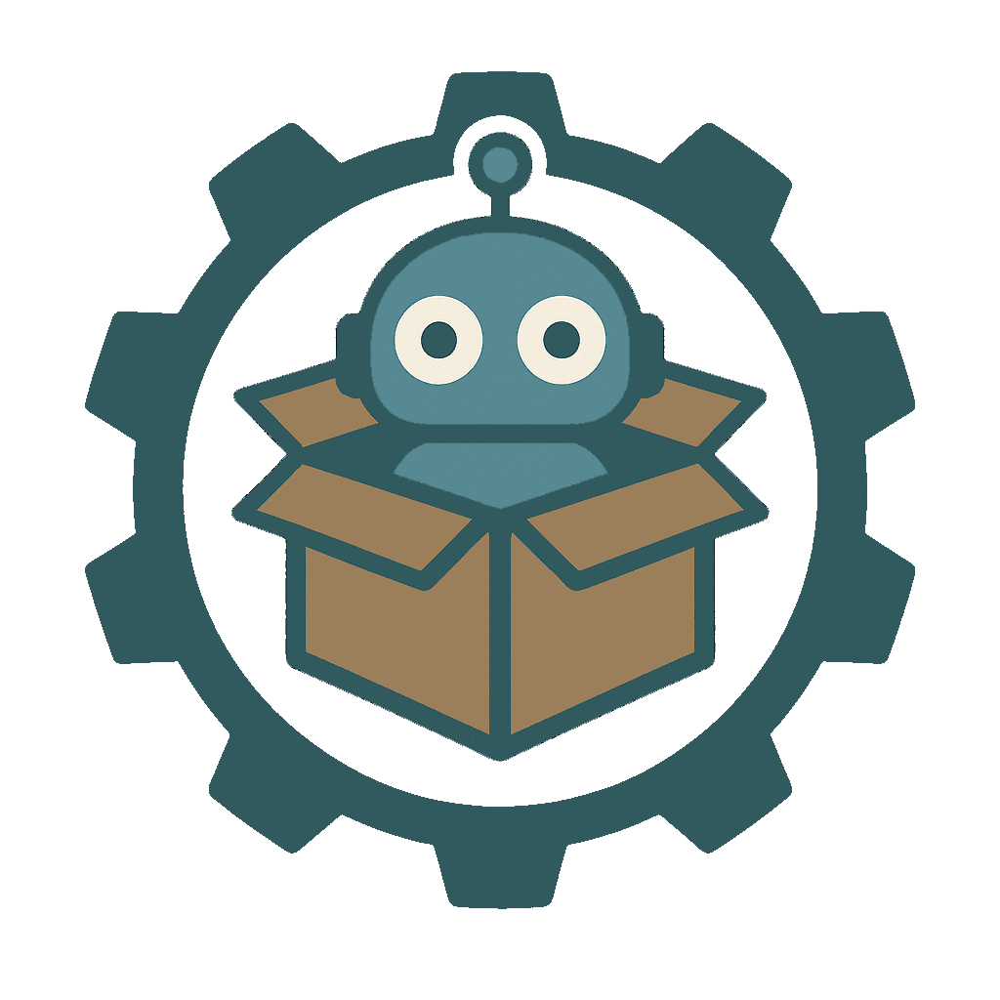

<div align="center">
  
</div>
<div align="center">
  
  <p>Forget the boring parts. Make building bots fun!</p>
  <p>A powerful CLI tool to scaffold, configure, and manage your Discord bot projects quickly and efficiently.</p>
</div>

---

## 📖 Table of Contents

- [About](#-about)
- [Features](#-features)
- [Installation](#%EF%B8%8F-installation)
- [Usage](#-usage)
- [Configuration](#%EF%B8%8F-configuration)
- [Troubleshooting](#-troubleshooting)
- [Roadmap](#%EF%B8%8F-roadmap-todo)
- [Version History](#-version-history)
- [License](#%EF%B8%8F-license)
- [Contributors](#-contributors)

---

## ✨ About

**Bot Box** is your ultimate companion for creating Discord bots with ease. Forget the tedious boilerplate and dive straight into building the unique functionalities that make your bot stand out.

Want to learn more? Check out our new [website](https://botbox-web.vercel.app/)!
Also includes detailed [documentation](https://botbox-web.vercel.app/docs/) on how to use BotBox!

<!--TODO: Update links for golang modules-->
Built with **Go**, [`Cobra`](https://github.com/spf13/cobra), [`Bubble Tea`](https://github.com/charmbracelet/bubbletea) and [`Huh`](https://github.com/charmbracelet/huh), Bot Box offers an intuitive command-line interface to quickly generate Discord bot projects. It champions a **cog-based architecture** for modularity, simplifies `.env` management, and provides built-in utilities to automate bot configuration and extension development.

---

## 🚀 Features

-   **Slash Command Support**: Seamless integration via `discord.ext.commands`.
-   **Automated Cog Generation**: Generate new cogs with predefined commands and arguments effortlessly.
-   **Project Initialization**: Quick setup with `.env` and `botbox.conf` files.
-   **Dynamic cog maintenance**: Used `botbox.conf` to dynamically load cogs and provide an interface for users to load, reload, and unload cogs as needed.
-   **Global Configuration Management**: Centralized settings stored in `$HOME/.config/botbox/config.json` for user preferences, update settings, and defaults.
-   **Automatic Updates**: Built-in update checking and automatic updating capabilities to keep your CLI tool current.
-   **Dual Configuration System**: Manage both global CLI settings and local project configurations with intuitive commands.
-   **Project Upgrade System**: Seamlessly upgrade legacy project configurations to the latest schema format.
-   **Modular Design**: Easily extendable and maintainable structure.

---

## 🛠️ Installation

Bot Box requires **Go** to be installed on your system.

### Prerequisites: Go Installation

It is highly recommended to follow the official [Golang documentation](https://go.dev/doc/install) for the most up-to-date installation instructions.

Alternatively, you can use `webi` for a quick installation:

**Linux/macOS:**

```sh
curl -sS https://webi.sh/golang | sh; \
source ~/.config/envman/PATH.env
```

**Windows:**

```powershell
curl.exe https://webi.ms/golang | powershell
```

### Install Bot Box CLI

Once Go is installed, use the following command to install Bot Box:

```sh
go install github.com/choice404/botbox/v2@latest
```

Bot Box will automatically create a global configuration file at `$HOME/.config/botbox/config.json` when you first run any command. This file stores your CLI preferences, update settings, and default values.

---

## 💡 Usage

Bot Box provides several commands to help you manage your bot project and CLI configuration.

### Project Management

#### Create a new Bot Box project

```sh
botbox create
```

This command will prompt you to provide project details (like bot name, prefix, etc.) and then generate a new project with initial files.

#### Initialize a Bot Box project in the current directory

```sh
botbox init
```

Use this command to set up a new Bot Box project in your current working directory.

#### Add a new cog to the current Bot Box project

```sh
botbox add
```

It is highly recommended to use `botbox add` to generate new cogs within your projects. While you *can* manually add cogs, this will incur overhead as you'll need to manually update `botbox.conf` and potentially `main.py`.

You'll be prompted to define:

-   Cog name
-   Command names and descriptions
-   Argument names, types, and descriptions
-   Return types

The new cog will be saved in the `cogs/` directory and automatically registered in `botbox.conf`.

#### Remove a cog from the current Bot Box project

```sh
botbox remove
```

You'll be prompted to select a cog to remove. This command will also update `botbox.conf` accordingly.

#### Upgrade project configuration

```sh
botbox project upgrade
```

Upgrade your `botbox.conf` file to the latest schema format. This command will:
- Parse your existing configuration file
- Analyze your cog files to extract detailed command information
- Create a backup of your original configuration
- Upgrade to the latest schema while preserving all settings

### Configuration Management

Bot Box now provides comprehensive configuration management for both global CLI settings and local project settings.

#### Display configuration

```sh
# Display local project configuration (default)
botbox config

# Display local project configuration (explicit)
botbox config -l

# Display global CLI configuration
botbox config -g
```

#### List all configuration keys and values

```sh
# List local project configuration (default)
botbox config list

# List local project configuration (explicit)
botbox config list -l

# List global CLI configuration
botbox config list -g
```

#### Get specific configuration values

```sh
# Get local project values (default)
botbox config get bot.name
botbox config get bot.author

# Get local project values (explicit)
botbox config get -l bot.description

# Get global CLI values
botbox config get -g user.default_user
botbox config get -g cli.check_updates
```

#### Set configuration values

```sh
# Set local project values (default)
botbox config set bot.name "My Awesome Bot"
botbox config set bot.command_prefix "!"

# Set local project values (explicit)
botbox config set -l bot.author "John Doe"

# Set global CLI values
botbox config set -g user.default_user "john_doe"
botbox config set -g cli.check_updates true
botbox config set -g cli.auto_update false
```

#### Synchronize cog configuration

```sh
botbox config sync
```

This command synchronizes your `botbox.conf` file with the actual cog files in your project, ensuring consistency between your configuration and code.

### Update Management

#### Update Bot Box

```sh
botbox update
```

Manually update Bot Box to the latest version. The CLI can also automatically check for updates and update itself based on your global configuration settings.

---

## ⚙️ Configuration

Bot Box uses a dual configuration system to manage both global CLI settings and local project settings.

### Global Configuration (`$HOME/.config/botbox/config.json`)

The global configuration file stores CLI-wide settings and user preferences. It's automatically created when you first run any Bot Box command. Key settings include:

- **CLI Settings**: Update checking and auto-update preferences
- **User Settings**: Default username and GitHub username
- **Display Settings**: UI preferences like color scheme and scroll behavior
- **Default Settings**: Default command prefix and auto-git initialization
- **Development Settings**: Preferred code editor

Example global configuration structure:

```json
{
  "cli": {
    "version": "2.5.0",
    "check_updates": true,
    "auto_update": false
  },
  "user": {
    "default_user": "john_doe",
    "github_username": "johndoe"
  },
  "display": {
    "scroll_enabled": true,
    "color_scheme": "default"
  },
  "defaults": {
    "command_prefix": "!",
    "python_version": "3.11",
    "auto_git_init": true
  },
  "dev": {
    "editor": "code"
  }
}
```

**Available Global Configuration Keys:**
- `cli.check_updates` - Enable/disable update notifications
- `cli.auto_update` - Enable/disable automatic updates
- `user.default_user` - Your default username
- `user.github_username` - Your GitHub username
- `display.scroll_enabled` - Enable/disable scrolling in UI
- `display.color_scheme` - UI color scheme preference
- `defaults.command_prefix` - Default bot command prefix
- `defaults.auto_git_init` - Auto-initialize git repositories
- `dev.editor` - Preferred code editor

**Note:** The `cli.version` and `defaults.python_version` keys are read-only and managed automatically by Bot Box.

### Local Project Configuration (`botbox.conf`)

This is the central configuration file for your Bot Box project, crucial for dynamically loading, reloading, and unloading cogs via `/src/main.py` and `/src/cogs/cogs.py`.

The Bot Box CLI tool automatically keeps `botbox.conf` synchronized with your project. If you choose to add or remove cogs manually (without the CLI tool), you *must* manually update `botbox.conf` or manage cog loading within `/src/main.py` and `/src/cogs/cogs.py`.

**Available Local Configuration Keys:**
- `bot.name` - Your bot's name
- `bot.description` - Your bot's description
- `bot.command_prefix` - Your bot's command prefix
- `bot.author` - Your name as the bot author

Example `botbox.conf` structure:

```json
{
  "botbox": {
    "version": "2.5.0"
  },
  "bot": {
    "name": "My Awesome Bot",
    "command_prefix": "!",
    "author": "Austin \"Choice404\" Choi",
    "description": "A really cool bot!"
  },
  "cogs": [{
    "name": "HelloWorld",
    "file": "helloWorld",
    "env": "development",
    "slash_commands": [
      {
        "Name": "hello",
        "Scope": "guild",
        "Type": "slash",
        "Description": "HelloWorld!",
        "Args": [],
        "ReturnType": "None"
      }
    ],
    "prefix_commands": []
  }]
}
```

### Configuration Schema Upgrades

Bot Box automatically handles configuration schema upgrades. If you have an older project with a legacy `botbox.conf` format, use:

```sh
botbox project upgrade
```

This will:
1. **Backup your original config** - Creates `botbox.conf.backup`
2. **Parse cog files** - Extracts detailed command information from your Python files
3. **Upgrade schema** - Converts legacy string arrays to modern CommandInfo objects
4. **Preserve settings** - Maintains all your existing bot configuration
5. **Add missing fields** - Ensures compatibility with the latest Bot Box version

**Legacy vs Modern Format:**

*Legacy format (pre-2.5.0):*
```json
{
  "cogs": [{
    "name": "MyCog",
    "file": "mycog",
    "slash_commands": ["command1", "command2"],
    "prefix_commands": ["old_command"]
  }]
}
```

*Modern format (2.5.0+):*
```json
{
  "cogs": [{
    "name": "MyCog",
    "file": "mycog",
    "slash_commands": [
      {
        "Name": "command1",
        "Type": "slash",
        "Scope": "guild",
        "Description": "Command description",
        "Args": [...],
        "ReturnType": "None"
      }
    ],
    "prefix_commands": [...]
  }]
}
```

---

## 🐛 Troubleshooting

-   **Missing `botbox.conf`?** Run `botbox init` in your project directory to generate it.
-   **Missing global config?** The global configuration file will be automatically created when you run any Bot Box command.
-   **Legacy config format?** Run `botbox project upgrade` to upgrade your configuration to the latest schema.
-   **Cogs not loading?**
    -   Verify cog names in `botbox.conf` match the actual file names in the `cogs/` directory.
    -   Ensure the cog files exist.
    -   Run `botbox config sync` to synchronize your configuration with your cog files.
-   **Token errors?** Make sure your `.env` file is present in the project root and contains `DISCORD_BOT_TOKEN=YOUR_TOKEN_HERE`.
-   **Update issues?** If automatic updates fail, try running `botbox update` manually.
-   **Configuration issues?** Use `botbox config list` to view all current settings, or `botbox config list -g` for global settings.
-   **Panic or crashes?** Ensure you're running the latest version with `botbox update`, and check that your project structure is valid.

---

## 🛣️ Roadmap (TODO)

-   [x] Expand `botbox.conf` to include:
    -   [x] More details about each command provided via `botbox add`.
    -   [ ] Expected bot responses.
-   [x] Global configuration management system
-   [x] Automatic update checking and updating
-   [x] Project configuration upgrade system
-   [ ] Add a proper changelog
-   [ ] New commands:
    -   [ ] `botbox edit` command for modifying existing cogs/commands.
    -   [x] `botbox project update` for migrating between major versions.
-   [ ] Advanced dynamic bot building:
    -   [ ] Create cogs containing "blocks" that can be dynamically added and connected for complex functionality through BotBox.
-   [ ] Enhanced project templates and scaffolding options.

---

## 📜 Version History

-   **2.5.2** Fixed a bit with the huh/tea display since long Huh.Groups won't display everything properly. Updated copyright and licenses in each file and updated command descriptions
-   **2.5.1** Made the final view in the custom tea/huh form manager scrollable (This is enabled regardless of scroll_enabled status in the global config for long content)
-   **2.5.0**: Added global CLI configuration system, comprehensive config management commands (`botbox config set/get/list` with `-l/-g` flags), automatic update checking and updating capabilities, project configuration upgrade system (`botbox project upgrade`), and improved configuration synchronization.
-   **2.4.1**: Updated the cli to use the alt screen buffer through Bubble Tea
-   **2.4.0**: Wrapped all the Huh forms in Tea for more complex functionality and smoother UX. Updated configuration to be more detailed and added more functionality for development.
-   **2.3.2**: Updated the add command so that the confirmation for command information is displayed properly
-   **2.3.1**: Fixed up some small stuff in the file generation here and there, version numbering, etc.
-   **2.3.0**: Added `remove` command; updated `botbox.conf` schema; improved prefix command generation support.
-   **2.2.6**: Fixed `add` command bug; added MIT license to generated files; updated project template.
-   **2.2.4**: Improved `README.md` generation; token input is now hidden.
-   **2.2.0**: Configuration transitioned to `botbox.conf`; `add` command modified.
-   **2.1.0**: Fixed issues with setting prefixes, license creation; added flags to `config` command.
-   **2.0.4**: Updated `README.md` with installation instructions and v2 imports.
-   **2.0.3**: Enforced single non-alphanumeric character custom prefixes in CLI form.
-   **2.0.2**: Brew release via taps; updated imports to use GitHub paths.
-   **2.0.1**: GitHub releases implemented using `goreleaser`.
-   **2.0.0**: Major refactor of the project in Go (Python scrapped for CLI core).
-   **1.0.0**: Initial version with basic boilerplate generation for cogs and main file.

*(Minor patch versions between major/minor releases are omitted for brevity)*

---

## ⚖️ License

This project is licensed under the [MIT License](LICENSE), © 2025 [Austin \"Choice404\" Choi](https://github.com/choice404).

---

## 🤝 Contributors

-   **[Austin Choi](https://github.com/choice404)** — Original author and maintainer
